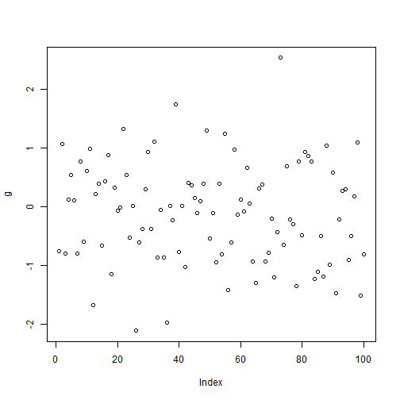

Description:
--------
This is an assigment meant to assist students learn and practice basic **R Programming** since majority of the the lab assignments and major assignment requires a good knowledge of R programming. Also, this assignment introduces **GitHub** to the students and requires them to use it, in order to submit this assignment. Furthermore in order to complete this assignment, students are required to Complete the **ToDo** exercises from the document **A (very) short introduction to R** this document is located at: https://cran.r-project.org/doc/contrib/Torfs+Brauer-Short-R-Intro.pdf 

More information about this assignment make be found in this link: https://open.senecac.on.ca/cms/mod/resource/view.php?id=44286

3 Some first examples of R commands
-----------------------------------

**3.1 Calculator**

**1 ToDo:** Compute the difference between 2014 and the year you started at this university and divide this by the difference between 2014 and the year you were born. Multiply this why 100 to get the percentage of your life you have spent at this university. Use brackets if you need them.

```r
((2014-2013)/(2014-1996))*100
```

```
## [1] 5.555556
```

**3.2 Workspace**

**2 ToDo:** Repeat the previous To Do, but with several steps in between. You can give the variables any name you want, but the name has to start with a letter.

```r
a <- (2014-2012)
a
```

```
## [1] 2
```

```r
b <- (2014-1996)
b
```

```
## [1] 18
```

```r
c <- 100
(a/b)*c
```

```
## [1] 11.11111
```

**3.4 Functions**

**3 ToDo:** Compute the sum of 4, 5, 8 and 11 by first combining them into a vector and then using the function sum.

```r
a <- c(4,5,8,11)
sum(a)
```

```
## [1] 28
```

**3.5 Plots**

**4 ToDo:** Plot 100 normal random numbers

```r
g <- rnorm(100)
plot(g)
```



4 Help and documentation
-------------------------

**5 ToDo:** Find help for the sqrt function
Note: this is from the output
Description:
abs(x) computes the absolute value of x, sqrt(x) computes the (principal) square root of x, ???{x}.

The naming follows the standard for computer languages such as C or Fortran.

```r
help("sqrt")
```

5 Scripts
--------------

**6 ToDo:** Make a file called firstscript. R containing R-code that generates 100 random numbers and plots them, and run this script several times.

```r
for (i in 1:3)
{
source("testscript.R")  
}
```


6 Data Structures
-----------------

**6.2 Matrices**

**7 ToDo:** Put the numbers 31 to 60 in a vector named P and in a matrix with 6 rows and 5 columns named Q. Tip: use the functions seq. Look at the different ways scalars, vectors and matrices are denoted in the workspace window.

```r
P <- seq(from=31, to=60)
Q <- matrix(data=P, nrow=6, ncol=5)
Q
```

```
##      [,1] [,2] [,3] [,4] [,5]
## [1,]   31   37   43   49   55
## [2,]   32   38   44   50   56
## [3,]   33   39   45   51   57
## [4,]   34   40   46   52   58
## [5,]   35   41   47   53   59
## [6,]   36   42   48   54   60
```

**6.3 Data Frames**

**8 ToDo:** Make a script file which constructs three random normal vectors of length 100. Call these vectors x1, x2, and x3. Make a data frame called t with three columns (called a, b and c) containing respectively x1, x1+x2 and x1+x2+x3. Call the following functions for this data frame: plot(t) and sd(t). Can you understand the results? Rerun this script a few times.

```r
x1 <- rnorm(100)*10
x2 <- rnorm(100)*10
x3 <- rnorm(100)*10
t <- data.frame(a = x1, b = x1+x2, c = x1+x2+x3)
plot(t)
```


```r
sd(t$a+t$b+t$c)
```

```
## [1] 38.25698
```

7 Graphics
----------

**9 ToDo:** Add these lines to the script file of the previous section. Try to find out, either by experimenting or by using the help, what the meaning is of rgb, the last argument of rgb, lwd, pch, cex.

```r
plot(t$a, type="l", ylim=range(t), 
    lwd=3, col=rgb(1,0,0,0.3))
lines (t$b, type="s", lwd=2,
    col=rgb(0.3,0.4,0.3,0.9))
points(t$c, pch=20, cex=4, 
    col=rgb(0,0,1,0.3))
```


 Meaning of rgb is
 
 The last arguments are.. 

8 Reading and writing data files
--------------------------------

**10 ToDo:** Make a file called tst1.txt in Notepad from the example in Figure 4 and store it in your working directory. Write a script to read it, to multiply the column called g by 5 and to store it as tst2.txt

```r
test <- read.table(file="tst1.txt", header = T)
test
```

```
##    a  g  x
## 1  1  2  3
## 2  2  4  6
## 3  4  8  1
## 4  8  7  5
## 5  9 11 24
## 6 16 32 58
## 7 32 64 96
```

```r
test$g*2
```

```
## [1]   4   8  16  14  22  64 128
```

```r
write.table(test$g*2, file="tst2.txt", row.names=FALSE)
test <- read.table(file="tst2.txt", header = T)
test
```

```
##     x
## 1   4
## 2   8
## 3  16
## 4  14
## 5  22
## 6  64
## 7 128
```

9 Not avaiable data
-------------------

**11 ToDo:** Compute the mean of the square root of a vector of 100 random numbers. What happens?

```r
mean(sqrt(rnorm(100)))
```

```
## Warning in sqrt(rnorm(100)): NaNs produced
```

```
## [1] NaN
```

10 Classes
----------

**12 ToDo:** Make a graph with on the x-axis: today, Sinterklaas 2014 and your next birthday and on the y-axis the number of presents you expect on each of these days. Tip: make two vectors first.

```r
date1 <- strptime( c("20160126", "20141206", "20160204"), format = "%Y%m%d")
numpres <- c(0,5,10)
g <- data.frame(date1, numpres)
plot(date1,numpres)
```


11 Programming tools
--------------------

**11.2 For-loop**

**13 ToDo:** Make a vector from 1 to 100. Make a for-loop which runs through the whole vector. Multiply the elements which are smaller than 5 and larger than 90 with 10 and the other elements with 0.1

```r
vector = c()
no <- 0
for ( i in 0:100 ){
  if (i < 5 | i > 90){
    vector[no] <- i * 10
  } else {
    vector[no] <- i * 0.1 
  }
  no <- no + 1
}
vector
```

```
##   [1]   10.0   20.0   30.0   40.0    0.5    0.6    0.7    0.8    0.9    1.0
##  [11]    1.1    1.2    1.3    1.4    1.5    1.6    1.7    1.8    1.9    2.0
##  [21]    2.1    2.2    2.3    2.4    2.5    2.6    2.7    2.8    2.9    3.0
##  [31]    3.1    3.2    3.3    3.4    3.5    3.6    3.7    3.8    3.9    4.0
##  [41]    4.1    4.2    4.3    4.4    4.5    4.6    4.7    4.8    4.9    5.0
##  [51]    5.1    5.2    5.3    5.4    5.5    5.6    5.7    5.8    5.9    6.0
##  [61]    6.1    6.2    6.3    6.4    6.5    6.6    6.7    6.8    6.9    7.0
##  [71]    7.1    7.2    7.3    7.4    7.5    7.6    7.7    7.8    7.9    8.0
##  [81]    8.1    8.2    8.3    8.4    8.5    8.6    8.7    8.8    8.9    9.0
##  [91]  910.0  920.0  930.0  940.0  950.0  960.0  970.0  980.0  990.0 1000.0
```

**11.3 Writing your own functions**

**14 ToDo:** Write a function for the previous ToDo, so that you can feed it any vector you like (as argument). Use a for-loop in the function to do the computation with each element. Use the standard R function length in the specification of the counter.

```r
ftest <- function(arg1,arg2){
  vector = c()
  arg1 <- arg1 - 1
  no <- 0
  for ( arg1 in arg1:arg2 ){
    if (arg1 < 5 | arg1 > 90){
      vector[no] <- arg1 * 10
    } else {
      vector[no] <- arg1 * 0.1 
    }
    no <- no + 1
  }
  vector
}
ftest (arg1 = -12, arg2 =120)
```

```
##   [1] -120.0 -110.0 -100.0  -90.0  -80.0  -70.0  -60.0  -50.0  -40.0  -30.0
##  [11]  -20.0  -10.0    0.0   10.0   20.0   30.0   40.0    0.5    0.6    0.7
##  [21]    0.8    0.9    1.0    1.1    1.2    1.3    1.4    1.5    1.6    1.7
##  [31]    1.8    1.9    2.0    2.1    2.2    2.3    2.4    2.5    2.6    2.7
##  [41]    2.8    2.9    3.0    3.1    3.2    3.3    3.4    3.5    3.6    3.7
##  [51]    3.8    3.9    4.0    4.1    4.2    4.3    4.4    4.5    4.6    4.7
##  [61]    4.8    4.9    5.0    5.1    5.2    5.3    5.4    5.5    5.6    5.7
##  [71]    5.8    5.9    6.0    6.1    6.2    6.3    6.4    6.5    6.6    6.7
##  [81]    6.8    6.9    7.0    7.1    7.2    7.3    7.4    7.5    7.6    7.7
##  [91]    7.8    7.9    8.0    8.1    8.2    8.3    8.4    8.5    8.6    8.7
## [101]    8.8    8.9    9.0  910.0  920.0  930.0  940.0  950.0  960.0  970.0
## [111]  980.0  990.0 1000.0 1010.0 1020.0 1030.0 1040.0 1050.0 1060.0 1070.0
## [121] 1080.0 1090.0 1100.0 1110.0 1120.0 1130.0 1140.0 1150.0 1160.0 1170.0
## [131] 1180.0 1190.0 1200.0
```

**15 ToDo Footnote:** Actually, people often use more for-loops than necessary. The ToDo above can be done more easily and quickly without a for-loop but with regular vector computations


```r
ftest2 <- function(arg1,arg2){
  vector = seq(from=arg1, to=arg2)
  vector2 <-  c(vector[vector<5 ]*10, vector[vector>4 & vector<91]*0.1,vector[vector>90]*10)
  vector2
}
ftest2(arg1 = -12, arg2 = 120)
```

```
##   [1] -120.0 -110.0 -100.0  -90.0  -80.0  -70.0  -60.0  -50.0  -40.0  -30.0
##  [11]  -20.0  -10.0    0.0   10.0   20.0   30.0   40.0    0.5    0.6    0.7
##  [21]    0.8    0.9    1.0    1.1    1.2    1.3    1.4    1.5    1.6    1.7
##  [31]    1.8    1.9    2.0    2.1    2.2    2.3    2.4    2.5    2.6    2.7
##  [41]    2.8    2.9    3.0    3.1    3.2    3.3    3.4    3.5    3.6    3.7
##  [51]    3.8    3.9    4.0    4.1    4.2    4.3    4.4    4.5    4.6    4.7
##  [61]    4.8    4.9    5.0    5.1    5.2    5.3    5.4    5.5    5.6    5.7
##  [71]    5.8    5.9    6.0    6.1    6.2    6.3    6.4    6.5    6.6    6.7
##  [81]    6.8    6.9    7.0    7.1    7.2    7.3    7.4    7.5    7.6    7.7
##  [91]    7.8    7.9    8.0    8.1    8.2    8.3    8.4    8.5    8.6    8.7
## [101]    8.8    8.9    9.0  910.0  920.0  930.0  940.0  950.0  960.0  970.0
## [111]  980.0  990.0 1000.0 1010.0 1020.0 1030.0 1040.0 1050.0 1060.0 1070.0
## [121] 1080.0 1090.0 1100.0 1110.0 1120.0 1130.0 1140.0 1150.0 1160.0 1170.0
## [131] 1180.0 1190.0 1200.0
```

References:
----------
R Markdown - Dynamic Documents for R
http://rmarkdown.rstudio.com/

Writing reproducible reports in R with markdown, knit and pandoc
http://nicercode.github.io/guides/reports/

Markdown
http://kbroman.org/knitr_knutshell/pages/markdown.html

Knitr with R Markdown
http://kbroman.org/knitr_knutshell/pages/Rmarkdown.html

R markdown cheatsheet
http://kbroman.org/knitr_knutshell/pages/Rmarkdown.html

Up and Running with R
http://www.lynda.com/R-tutorials/Up-Running-R/120612-2.html

####Embedded code


The current time is Thu Jan 28 9:26:13 PM 2016.


##### The end
